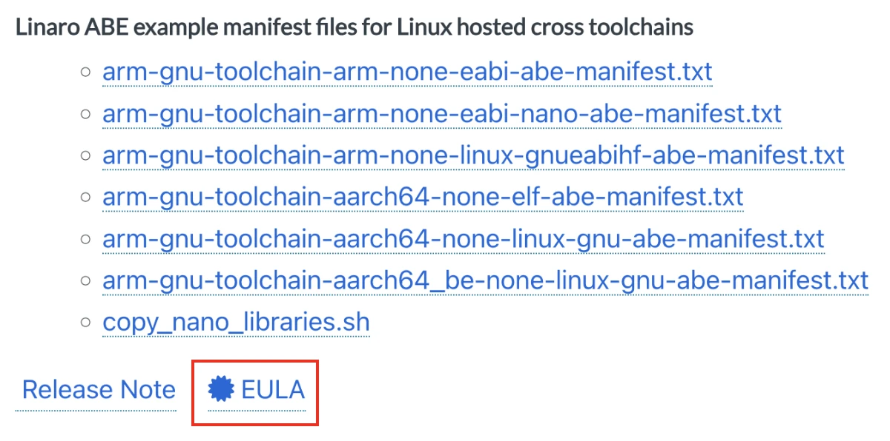

# ARM GNU Toolchain Repo

A conan tool package for the ARM GNU Toolchain (`arm-none-eabi-gcc`). By adding
this tool package to your conan build profile, your project will be cross
compiled using this toolchain.

Supported version:

- GCC 11.3
- GCC 12.2
- GCC 12.3
- GCC 13.2
- GCC 13.3
- GCC 14.2

Supported Architectures:

- cortex-m0
- cortex-m0plus
- cortex-m1
- cortex-m3
- cortex-m4
- cortex-m4f
- cortex-m7
- cortex-m7f
- cortex-m7d
- cortex-m23
- cortex-m33
- cortex-m33f
- cortex-m33p
- cortex-m35pf
- cortex-m55
- cortex-m85

Missing Architectures:

- cortex-m55h
- cortex-m55f
- cortex-m55d
- cortex-m85h
- cortex-m85f
- cortex-m85d

> [!NOTE]
> The architecture names may have a trailing characters which indicates if the
> architecture has access to a floating point unit.
>
> - `f` indicates that the processor has a single precision (32-bit) hard
> floating point unit available.
> - `h` indicates that the processor has a half precision (16-bit) hard
> floating point unit available.
> - `d` indicates that the processor has a double precision (64-bit) hard
> floating point unit available.

All binaries are downloaded from the official
[ARM GNU Toolchain Download Page](https://developer.arm.com/downloads/-/arm-gnu-toolchain-downloads).

## 🚀 Quick Start

To use the ARM GNU Toolchain for your application, you should install the
pre-made compiler profiles to your local `conan2` cache like so:

```bash
conan config install -sf conan/profiles/v1 -tf profiles https://github.com/libhal/arm-gnu-toolchain.git
```

This will provide you profiles that you can access via conan using the argument
`-pr arm-gcc-<gcc-version>`. For example `-pr arm-gcc-12.3`. These profiles
only include the compiler information. You will need a "target" profile in
order to actually build something. The target profile must include the
`os=baremetal`, `arch` set to a valid architecture. `build_type` is optional

Add the following contents to a profile named `target_profile` (feel free to
rename to whatever you'd like):

```jinja2
[settings]
build_type=MinSizeRel
arch=cortex-m4f
os=baremetal
```

Now we can build your application using ARM GCC 12.3 for the Cortex M4F
processor, with build type set to MinSizeRel, by executing the following
command:

```bash
conan build path/to/application -pr arm-gcc-12.3 -pr ./target_profile
```

## 🔗 Adding this as a dependency to your project

For this tool package to work correctly, the toolchain **MUST** be added as a dependency using the `tool_requires` command within at least one profile in the build. Like the following:

```jinja2
[settings]
compiler=gcc
compiler.cppstd=23
compiler.libcxx=libstdc++11
compiler.version=12.3

[tool_requires]
arm-gnu-toolchain/12.3
```

By adding `arm-gnu-toolchain/12.3` to your profile, every dependency of your
application will use this toolchain for its compilation. The tool package
should NOT be directly added to an application's `conanfile.py` as this will
not propagate correctly and will likely result in build failures.

## 🧾 Using the pre-made profiles

This repo provides are pre-made profiles within the `conan/profiles/`
directory. The profiles can be installed into your local conan cache directory
via this command:

```bash
conan config install -sf conan/profiles/v1 -tf profiles https://github.com/libhal/arm-gnu-toolchain.git
```

To perform this with a locally cloned repo run this command at the root of the
repo:

```bash
conan config install -sf conan/profiles/v1 -tf profiles .
```

Profiles are versioned in directories `v1/`, `v2/`, `v3/`, etc. Currently there
are no sub versions. The version increment is not well defined as of yet, but
should be incremented if the behavior of the profiles changes significantly
enough to break current applications.

All profiles use `libstdc++11` as this is the latest GCC C++ ABI.

## 📦 Building & Installing the Tool Package

When you create the package it will download the compiler from the official website and store it within your local conan package cache.

```bash
conan create . --version <insert version>
```

For example, to create/install GCC 12.3

```bash
conan create . --version 12.3
```

## 🎛️ Options

### `local_path` (Default: "")

This option accepts a string. If the string is NOT empty the `conanfile.py`
will use this path as the location of the ARM GNU Toolchain rather than
downloading the official one. This is beneficial if you are you building the
toolchain locally or you using prebuilt binaries from some other source?

To create an ARM GCC 14.2 with toolchain directory pointed to
`/path/to/arm-gnu-toolchain-root/`, invoke the following command:

```bash
conan create . --version 14.2 -o "*:local_path=/path/to/arm-gnu-toolchain-root/
```

Replace `/path/to/arm-gnu-toolchain-root/` with the actual path to your
toolchain.

The toolchain directory and GCC version in the conan build MUST match, otherwise the compiler package may not work properly.

### `default_arch` (Default: `True`)

This option can be `True` or `False` and when set to `True` will inject the
appropriate `-mcpu` and `-mfloat-abi` for the `arch` defined in your build
target profile.

For `cortex-m4`, the flags would be `-mcpu=cortex-m4` and `-mfloat-abi=soft`.
For `cortex-m4f`, the flags would be `-mcpu=cortex-m4` and `-mfloat-abi=hard`.

### `lto` (Default: `True`)

This option can be `True` or `False` and when set to `True` will inject the
flag `-flto` to C, CXX, and link arguments.

### `fat-lto` (Default: `True`)

This option can be `True` or `False` and when set to `True` will inject the
flag `-ffat-lto-objects` to C, CXX, and link arguments. This option is
**ignored** if the `lto` option is not `True`.

### `function_sections` (Default: `True`)

This option can be `True` or `False` and when set to `True` will inject the
flag `-ffunction-sections` to C and CXX arguments.

### `data_sections` (Default: `True`)

This option can be `True` or `False` and when set to `True` will inject the
flag `-fdata-sections` to C and CXX arguments.

### `gc_sections` (Default: `True`)

This option can be `True` or `False` and when set to `True` will inject the
flag `--gc_sections` to the linker arguments.

## ✨ Adding New Versions of GCC

If ARM produces a new GCC version on their
["Arm GNU Toolchain Downloads"](https://developer.arm.com/downloads/-/arm-gnu-toolchain-downloads)
page and you'd like for the conan package to also support that version of GCC,
please follow these instructions and replace `XY.Z` with the correct GCC
version.

1. Add version to the `/config.yml` file. Should look like
   this:

  ```yaml
  versions:
    "11.3":
      folder: "all"
    "12.2":
      folder: "all"
    "12.3":
      folder: "all"
    "XY.Z":
      folder: "all"
  ```

2. Add file `XY.Z.yml` to `/.github/workflows/` with the
   following contents:

  ```yaml
  name: 🚀 12.3 Deploy

  on:
    workflow_dispatch:
    pull_request:
    push:
      branches:
        - main

  jobs:
    deploy:
      uses: ./.github/workflows/deploy.yml
      with:
        version: "XY.Z"
      secrets: inherit
  ```

3. Add profile `arm-gcc-XY.Z` to directory `/conan/profiles/v1` with the
   following contents:

  ```yaml
  [settings]
  compiler=gcc
  compiler.cppstd=23
  compiler.libcxx=libstdc++11
  compiler.version=XY.Z

  [tool_requires]
  arm-gnu-toolchain/XY.Z
  ```

4. Add License for ARM GNU Toolchain version `XY.Z`. This can be done by
   right-clicking on the `EULA` button and clicking on the "Copy Link Address"
   option as shown in this picture:



5. Add the download URL & SHA256 hash for each of the following fields in the
   `all/conandata.yml` file. We only want cross compilers for the
   `AArch32 bare-metal target (arm-none-eabi)`. See section [finding download urls](#finding-download-urls) for more information about how to acquire this information.

  ```yaml
  sources:
    "XY.Z":
      "Linux":
        "x86_64":
          url: ""
          sha256: ""
        "armv8":
          url: ""
          sha256: ""
      "Macos":
        "x86_64":
          url: ""
          sha256: ""
        "armv8":
          url: ""
          sha256: ""
      "Windows":
        "x86_64":
          url: ""
          sha256: ""
  ```

6. DONE! Congratz you did it. Make a PR with the title
   `:sparkles: Add support for GCC XY.Z`.

## Finding Download URLs

The URLs on the download website look like this:

```plaintext
https://developer.arm.com/-/media/Files/downloads/gnu/13.2.rel1/binrel/arm-gnu-toolchain-13.2.rel1-aarch64-arm-none-eabi.tar.xz?rev=17baf091942042768d55c9a304610954&hash=06E4C2BB7EBE7C70EA4EA51ABF9AAE2D
```

Unfortunately this will not work with Conan. This URL actually performs a
redirection, which resolves to the actual file to be downloaded. We want that
redirected URL. To get that URL run this through the `wget` command you get
output like this:

```bash
wget "https://developer.arm.com/-/media/Files/downloads/gnu/13.2.rel1/binrel/arm-gnu-toolchain-13.2.rel1-aarch64-arm-none-eabi.tar.xz\?rev\=17baf091942042768d55c9a304610954\&hash\=06E4C2BB7EBE7C70EA4EA51ABF9AAE2D"
```

```plaintext
--2025-03-10 12:23:33--  https://developer.arm.com/-/media/Files/downloads/gnu/13.2.rel1/binrel/arm-gnu-toolchain-13.2.rel1-aarch64-arm-none-eabi.tar.xz?rev=17baf091942042768d55c9a304610954&hash=06E4C2BB7EBE7C70EA4EA51ABF9AAE2D
Resolving developer.arm.com (developer.arm.com)... 23.67.33.42, 23.67.33.47
Connecting to developer.arm.com (developer.arm.com)|23.67.33.42|:443... connected.
HTTP request sent, awaiting response... 302 Moved Temporarily
Location: https://armkeil.blob.core.windows.net/developer/Files/downloads/gnu/13.2.rel1/binrel/arm-gnu-toolchain-13.2.rel1-aarch64-arm-none-eabi.tar.xz [following]
--2025-03-10 12:23:33--  https://armkeil.blob.core.windows.net/developer/Files/downloads/gnu/13.2.rel1/binrel/arm-gnu-toolchain-13.2.rel1-aarch64-arm-none-eabi.tar.xz
Resolving armkeil.blob.core.windows.net (armkeil.blob.core.windows.net)... 20.209.15.139
Connecting to armkeil.blob.core.windows.net (armkeil.blob.core.windows.net)|20.209.15.139|:443... connected.
HTTP request sent, awaiting response... 200 OK
Length: 176409124 (168M) [application/octet-stream]
Saving to: ‘arm-gnu-toolchain-13.2.rel1-aarch64-arm-none-eabi.tar.xz?rev=17baf091942042768d55c9a304610954&hash=06E4C2BB7EBE7C70EA4EA51ABF9AAE2D’
```

The line starting with `Location:` holds the desired URL. Take that URL and put
it under the corresponding OS and Architecture. In this case, the URL would be
put under `Linux` and `armv8`.

In order to get a sha256 sum, allow the wget command to complete and run the
following on the command:

```bash
shasum -a 256 <insert file name>
```

Install this or the equivalent for your machine.
